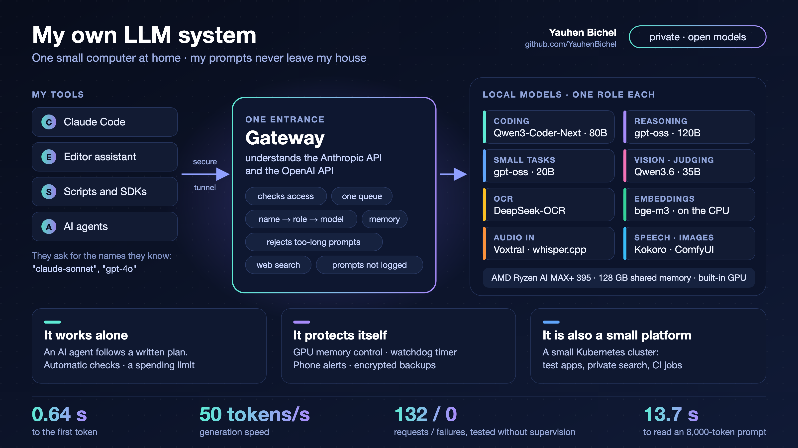
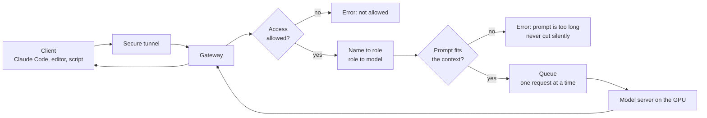
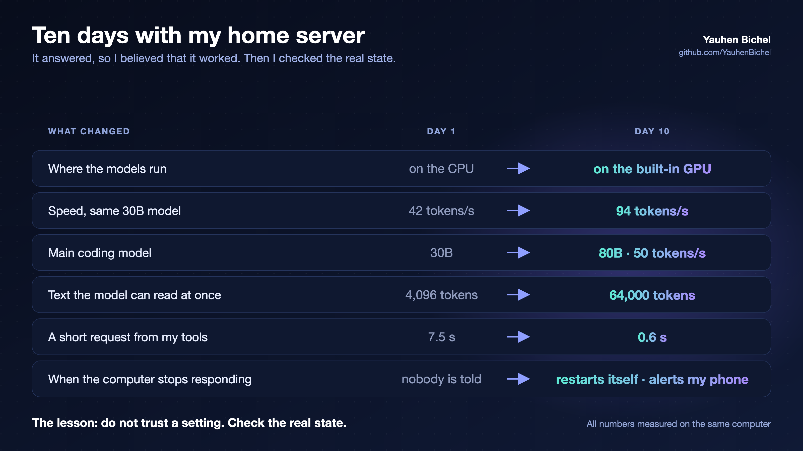

# yserver: my local LLM system

One small computer at home, which I call yserver, serves open language models to my coding tools, my scripts and my side projects.
This repository describes the system: what runs, how a request flows, how fast it is, and what went wrong.

It is a description, not an installer. The parts that are useful to other people are published as separate
projects, and they are linked below.

## Why I built it

I use Claude Code, an editor assistant and my own scripts every day. I wanted them to work with models that I
run myself. My prompts stay private, there is no usage limit, and there is no price per token. I still use the
large cloud models for hard tasks. Much of my daily work does not need them.

## The computer

| Part | What it is |
|---|---|
| Computer | GMKtec EVO-X2, a small desktop |
| Processor | AMD Ryzen AI MAX+ 395 ("Strix Halo"), with a built-in Radeon 8060S GPU |
| Memory | 128 GB. The CPU and the GPU share it. Half is reserved for the GPU, so a 52 GB model fits on a built-in GPU |
| System | Ubuntu 24.04, ROCm (the AMD software for GPU computing) |

## What runs

| Layer | Part | What it does |
|---|---|---|
| Clients | Claude Code, an editor assistant, scripts, side projects | They speak the Anthropic API or the OpenAI API. They do not know which model answers |
| Entrance | A secure tunnel, then **one gateway** | The entrance for my tools. It checks access, chooses the model, checks the prompt length, and keeps a queue |
| Models | One model server on the GPU | One large model in memory at a time, with a context of 64,000 tokens |
| Models | Small servers for speech, transcription and images | Started when needed, stopped when idle |
| Agents | An agent runner | It gives a model a task, tools, a budget and checks. Every step is saved |
| Around it | A small Kubernetes cluster | Test environments, web search for the models, CI runners for my private repositories |
| Operations | Memory guards, a hardware watchdog timer, alerts to my phone, backups with a second copy | Most of my time went here |

### Roles and models

A client asks for a name it already knows, such as `claude-sonnet-4-5` or `gpt-4o`. The gateway maps the name to
a **role**, and the role points to a local model. When I change a model, no client needs a change.

| Role | Model |
|---|---|
| coding (always in memory) | Qwen3-Coder-Next, 80B-A3B, Q4_K_M, 52 GB |
| reasoning | gpt-oss 120B |
| small tasks | gpt-oss 20B |
| judging and vision | Qwen3.6 35B |
| OCR | DeepSeek-OCR |
| embeddings | BAAI/bge-m3, on the CPU, so it never removes the coding model from the GPU |
| audio input | Voxtral Mini 3B, and whisper.cpp for other languages |
| speech output | Kokoro |

## How a request flows

More flows, each with a diagram, are in [docs/flows.md](docs/flows.md):
the prompt-length check, the queue that prefers the loaded model, the agent loop, how heavy jobs share the GPU,
how the system was built by an agent with automatic checks, and what happens when the computer stops.

The design, part by part, with the reason for each decision: [docs/architecture.md](docs/architecture.md).

## How fast it is

Measured on 19 September 2026 with
[inference-benchmarker](https://github.com/huggingface/inference-benchmarker), on the coding model, through
the gateway.

| Measurement | Result |
|---|---|
| Requests | 132, with **0 failures** |
| Time to the first token, 200-token prompt, model already loaded | **0.64 s** (90 % of requests: under 0.73 s) |
| Generation speed | **50 tokens per second**, and 45 with an 8,000-token context |
| Reading an 8,000-token prompt | **13.7 s**, about 590 tokens per second |
| Three requests at the same time | the first token takes 13 times longer; total speed rises by only 6 % |
| A turn of a long agent session, when the server still has the conversation in its cache | **1.0 to 1.4 s**, for prompts of 3,000 to 12,000 tokens |
| The same turn, when the cache was lost | 12 to 35 s |

All numbers, with the method and the limits of each: [docs/numbers.md](docs/numbers.md).

## What I learned

The short list. The full stories are in [docs/lessons.md](docs/lessons.md).

1. **Plan one part of your time for the models and nine parts for operations.**
2. **Reject a prompt that is too long. Never cut it silently.** A cut prompt once returned another request's
   answer, with status 200.
3. **Shared memory hides GPU memory.** On one bad day, 35 to 42 GiB was missing from every report.
4. **Make every check read the real state, not the configuration.** My watchdog was "active" in my script and
   not active in reality. The computer then stayed frozen for 8 hours and 22 minutes.
5. **Protect the model and its cache from other programs.** In my agent's own records, the turns that lost the
   cache were 31 % of the turns and took 85 % of the prompt-reading time.
6. **Local models cannot review code yet.** One only praised. One invented errors that did not exist.
7. **A finding is an assumption until a test confirms it.** This includes my own findings.

## Related projects

### Public parts of this system

| Project | What it is | How it belongs here |
|---|---|---|
| [ollama, branch `feat/context-shift-env`](https://github.com/YauhenBichel/ollama/tree/feat/context-shift-env) | A setting that lets the model server refuse a prompt that is too long | My fix for lesson 2. Proposed to the project as [ollama/ollama#18399](https://github.com/ollama/ollama/pull/18399). I run this build |
| [moe-fit](https://github.com/YauhenBichel/moe-fit) | Will this mixture-of-experts model run on my machine, and how fast? Answered from the model's index, before downloading it | How I choose models for 128 GB of shared memory |
| [silent-failures](https://github.com/YauhenBichel/silent-failures) | Small read-only checks for Linux servers: a watchdog that never loads, a nightly job that fails every night, a box that froze and nobody was told | The tools from lesson 4 |
| [homerunner](https://github.com/YauhenBichel/homerunner) | Run your private repositories' CI on a machine you already own. It refuses public repositories | The CI runners on this computer |
| [strix-halo-jax](https://github.com/YauhenBichel/strix-halo-jax) | JAX and MuJoCo MJX on the same AMD processor, from pip wheels | The same hardware, a different kind of work |
| [belarusian-asr](https://github.com/YauhenBichel/belarusian-asr) | Belarusian speech recognition on the CPU, behind an OpenAI-compatible server | One of the small speech servers |

### Projects that use a system like this one

| Project | What it is |
|---|---|
| [humanoid-companion](https://github.com/YauhenBichel/humanoid-companion) | A small humanoid robot you can talk to. Its brain is a local LLM that you run yourself |
| [humanoid-desktop](https://github.com/YauhenBichel/humanoid-desktop) | A robot teammate on the Mac desktop. It uses the language model you choose |
| [py-harness](https://github.com/YauhenBichel/py-harness) | Four coding jobs with a local 8B model, one action at a time, inside one folder |
| [belarusian-tts](https://github.com/YauhenBichel/belarusian-tts) | Belarusian text-to-speech that you can self-host, behind an OpenAI-style API |

### On Hugging Face

| Space | What it is |
|---|---|
| [my-own-llm-system](https://huggingface.co/spaces/YauhenBichel/my-own-llm-system) | The architecture and the story of the first ten days, as a page |
| [belarusian-asr](https://huggingface.co/spaces/YauhenBichel/belarusian-asr) | The speech recognition work |
| [privacy-gate-llm-demo](https://huggingface.co/spaces/YauhenBichel/privacy-gate-llm-demo) | A small model that answers one question: must this text stay on this machine? |

### Not public yet

The gateway, the agent runner, the router on my laptop (it decides between my local model and the cloud, with
privacy rules first), and a checker for masked database copies are private today. I plan to publish the parts
that are useful to other people.

### Writing

Stories about this work, on [Medium](https://medium.com/@yauhen.bichel):

- [I built my own LLM system at home](https://medium.com/@yauhen.bichel/i-built-my-own-llm-system-at-home-e92514a3b2be): the short version, a 2 minute read
- [Ten days with my home server: how I made it fast, stable and able to work alone](https://medium.com/@yauhen.bichel/ten-days-with-my-home-server-how-i-made-it-fast-stable-and-able-to-work-alone-dab7a26f290e): the long version
- [I sent a prompt that was too long. The server answered someone else's question.](https://medium.com/@yauhen.bichel/i-sent-a-prompt-that-was-too-long-the-server-answered-someone-elses-question-3757a17c52a7): the silent error behind [flow 3](docs/flows.md#3-the-prompt-length-check) and [lesson 2](docs/lessons.md#2-reject-a-prompt-that-is-too-long-never-cut-it-silently)

## What is left out, on purpose

This repository describes a computer in my home. So it has no addresses, no ports, no host names, no network
layout, no keys, no configuration files, and no list of what is still weak. The health-related app that uses
this system for testing is not described, and no data of its users was ever used here.

## Words used here

See [docs/glossary.md](docs/glossary.md).

## Licence and credits

Text and diagrams: [CC BY 4.0](LICENSE). Please credit "Yauhen Bichel" and link to this repository.

An AI coding assistant helped me to build the system and to write these pages. I checked the facts against my
own logs and measurements. The mistakes are mine.
