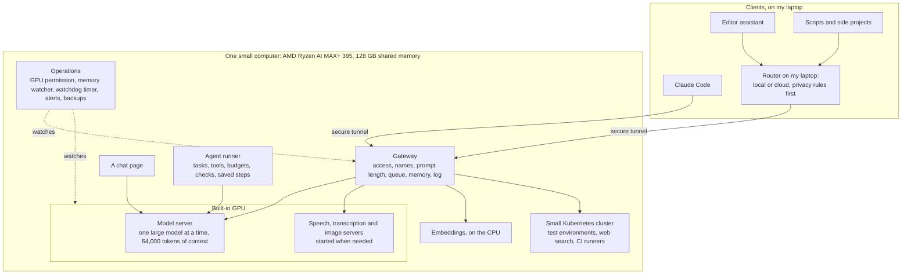

# Architecture

The system in parts, with the reason for each decision. For the flows between the parts, see
[flows.md](flows.md).

## The gateway

A gateway is a small service that receives every request first. Mine is a FastAPI program.

| Decision | Reason |
|---|---|
| It understands both the Anthropic API and the OpenAI API | Claude Code speaks one, most other tools speak the other. No client needs a special mode |
| It forwards requests and does not rebuild them | It changes the model name and passes the data through. It does not interpret streaming or tool calls, because it could get them wrong. This kept it small |
| Names work in two steps: name to role, role to model | A change of model is one line. Clients keep the names they already know |
| `auto` chooses by content | Images go to the vision or OCR model, audio goes to the audio model, everything else goes to the coding model |
| It counts tokens and rejects a prompt that is too long | A cut prompt gives a wrong answer that looks right. An error is better |
| One queue, one request at a time | The model server is not faster with parallel requests. A queue makes the waiting visible, and every answer reports its waiting time |
| The queue prefers the loaded model, for at most 2 minutes | A change of model costs 20 to 50 seconds and the cache |
| Embeddings have their own lane, on the CPU | A search in memory must never remove the coding model from the GPU |
| Memory: instructions, documents and facts, found with embeddings | The model gets only what is relevant to the request |
| Web search and page fetch for the models | The search engine runs on the same computer, so searches stay private too |
| One log line per request, without the prompt | I can see who waited, how long, and for which model. The content stays private |

## The model server

An open-source model server with ROCm, the AMD software for GPU computing.

- **One large model in memory at a time.** The coding model stays loaded. Other roles load when asked, and the
  coding model comes back afterwards.
- **A context of 64,000 tokens for every model**, set once on the server. A client that asks for a different
  size would cause a reload, so clients never set it.
- **It refuses a prompt that is too long.** This is my own change to the server, proposed to the project
  (see the README). Before it, the server cut the prompt silently.
- **The unchanged start of a prompt is reused.** This is why a long agent session is fast at all: a turn adds
  about 80 new tokens, and only these are read. Anything that unloads the model throws this away, and another
  conversation on the same server can do the same.

## The models

See the table in the [README](../README.md#roles-and-models). Most are GGUF files from the Hugging Face Hub.

How I choose them: the main limit is memory, not compute. A mixture-of-experts model with 80 billion weights,
of which 3 billion are active for each token, reads as fast as a small model and knows as much as a large one.
It needs 52 GB, and the computer has room for that. To decide before downloading, I read the model's index
file: [moe-fit](https://github.com/YauhenBichel/moe-fit).

## The agent runner

It gives a model a task and lets it work for a long time without me.

| Decision | Reason |
|---|---|
| The model fills a JSON form with a fixed list of actions | Local models are not reliable with tool calls. One never used them, one invented tool names. A form that the server enforces cannot go wrong in this way |
| Observe, decide, act, verify, save | Every step is saved, so a crash loses nothing |
| "Finish" starts automatic checks; the task ends only when they pass | A model that says "done" is not evidence |
| Tools work only inside one workspace folder, with a clean environment | A mistake stays in one folder |
| A policy can refuse a command or ask me first | The reason for a refusal goes back to the model, so it can choose another way |
| Budgets: turns, tokens, time. It also notices when the model repeats itself | A stuck model stops; it does not run all night |
| The history only grows | The model server can reuse what it has read |
| It reports turns that lost the server's cache | I lost hours to this once, and nothing told me |

## The router on my laptop

My tools on the laptop talk to one address. A small router decides for each request: my local system, or a
cloud model. Privacy rules come first and are a hard gate: text that must stay on my machines always goes to
the local model. The rules are a YAML file that I can read. See [flows.md](flows.md#6-local-model-or-cloud-model).

## The small Kubernetes cluster

It runs on the same computer and holds everything that is not a model:

- test environments for my applications, with a masked copy of the data;
- a search engine that the models use for web search;
- CI runners, so that my private repositories are tested on my own machine
  ([homerunner](https://github.com/YauhenBichel/homerunner));
- one-time jobs. The speed test in the README ran as a job, without supervision.

## Operations

This is where most of the time went.

| Part | What it does |
|---|---|
| GPU permission | Every heavy job asks before it uses the GPU. The resident model is unloaded for it |
| Memory watcher | Every 2 seconds: the GPU memory of each program, and the memory that the driver hides from the normal reports |
| Memory limits | A fixed upper limit for the hidden memory, and a kernel control group that protects each workload's GPU memory |
| Hardware watchdog timer | A timer inside the chipset. If the system stops resetting it, it restarts the computer in about 30 seconds |
| Alerts | To my phone. Each alert says what to do. They check the real state: when the last backup really succeeded, not whether its timer is active |
| A watcher outside the computer | My laptop notices when the computer is silent, because alerts that run on a frozen computer are frozen too |
| A daily test of every role | A real request to every model: a text question, an image, a piece of audio, an embedding. It found two dead models that 340 unit tests did not |
| A daily count of model loads | Normal is under ten a day. Far more means that programs are fighting over the GPU |
| Backups | Every night, encrypted, with a second copy on another machine, and a stamp that says when the last one really succeeded |
| A journal | Everything I do, with times, including my own mistakes. It allowed me to rebuild a fix that I had lost |

Tools from this work that are useful on any Linux server:
[silent-failures](https://github.com/YauhenBichel/silent-failures).

## How it was built

An AI coding agent did much of the building, on the computer itself, from a written plan. Every step has an
automatic check that the agent cannot influence, a spending limit and a report. The agent has no administrator
rights. When a step needs them, it is a script that first prints what it will do, and I run it myself.
See [flows.md](flows.md#8-how-the-system-was-built).
