# Flows

Each flow has a diagram and a short explanation. The diagrams are written in Mermaid, so GitHub draws them.

1. [A request, from client to model](#1-a-request-from-client-to-model)
2. [From a name to a model](#2-from-a-name-to-a-model)
3. [The prompt-length check](#3-the-prompt-length-check)
4. [The queue, and why it prefers the loaded model](#4-the-queue-and-why-it-prefers-the-loaded-model)
5. [The agent loop](#5-the-agent-loop)
6. [Local model or cloud model](#6-local-model-or-cloud-model)
7. [How heavy jobs share the GPU](#7-how-heavy-jobs-share-the-gpu)
8. [How the system was built: an agent, a plan, and checks it cannot influence](#8-how-the-system-was-built)
9. [When the computer stops](#9-when-the-computer-stops)
10. [Backups](#10-backups)

---

## 1. A request, from client to model

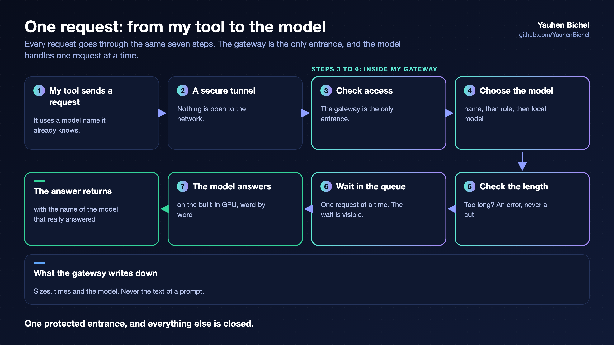

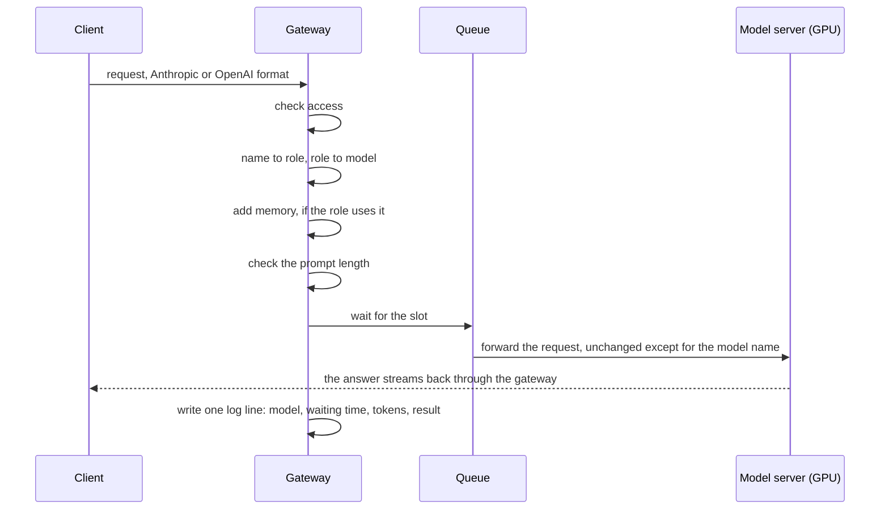

The gateway forwards requests and does not rebuild them. It changes the model name and passes the data through.
It does not interpret streaming or tool calls, because it could get them wrong.

## 2. From a name to a model

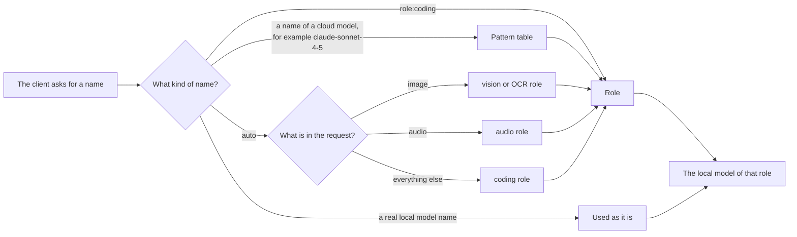

Two steps, name to role and role to model, mean that a change of model is one line in one file. No client
needs a change.

## 3. The prompt-length check

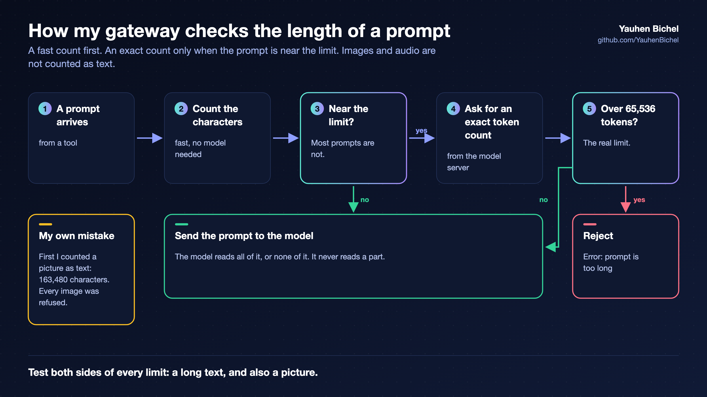

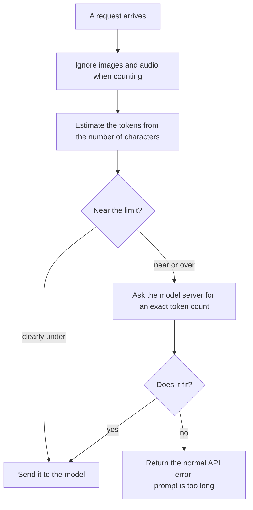

Why this exists: a model server once cut a long prompt to half of its limit, returned status 200, and sent
back the answer to the previous request. The full story is lesson 2 in [lessons.md](lessons.md).

Two details cost me a day each:

- An image in a request is a long text in base64. My first check counted it as normal text and refused every
  image. Test both sides of a limit, and test every kind of input.
- The check is a second line of defence. The first line is the model server itself, which now refuses instead
  of cutting (see the `ollama` branch in the README).

## 4. The queue, and why it prefers the loaded model

The model server handles one request at a time, and one large model fits in memory at a time. Two facts follow:

- More parallel requests do not make it faster. They only wait. So the queue does not remove waiting, it
  makes waiting visible: every answer carries its waiting time.
- A change of model costs 20 to 50 seconds of loading, and the new model starts with an empty cache. Two
  programs that alternate between two models pay this on every request.

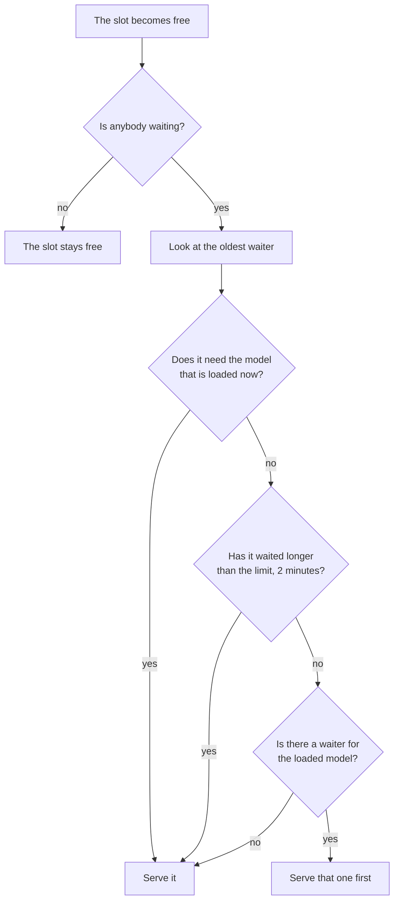

Four waiters for models A, B, A, B then cost one change of model, not three. Nobody waits longer than the limit
plus one request because of this rule.

## 5. The agent loop

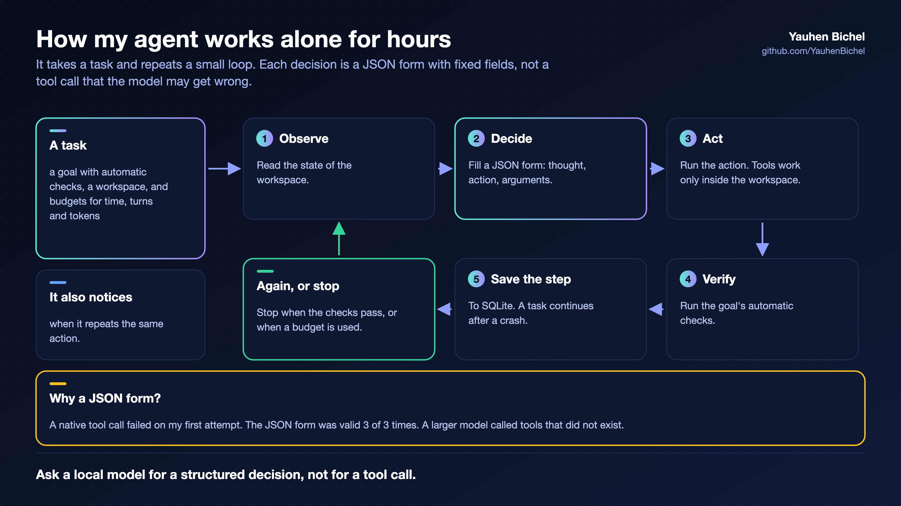

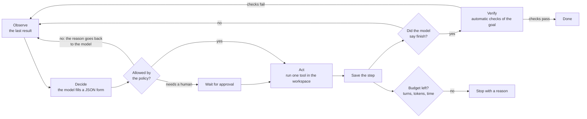

The decisions that matter:

- **The model fills a form; it does not call tools.** The form is a JSON schema with a fixed list of actions.
  The model server forces the answer into this form. In my tests, one local model never used tool calls and
  another invented tool names. With a fixed list, neither can happen.
- **"Finish" is a request, not a fact.** The task ends only when automatic checks pass.
- **The history only grows.** Nothing in it is edited. The model server can then reuse what it has already
  read, and a turn costs about 1 second instead of 12 to 35.
- **Every step is saved.** After a crash the task continues from the last step.
- **A budget stop is a stop reason, not a success.**

## 6. Local model or cloud model

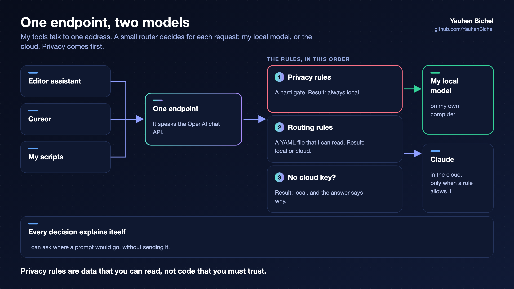

On my laptop, a small router sits in front of both my local system and the cloud. My tools talk to one address.

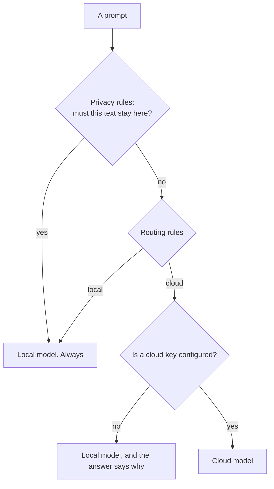

The privacy rules are a hard gate and they come first. They are a file that I can read, not code that I must
trust. I can also ask where a prompt would go, without sending it.

## 7. How heavy jobs share the GPU

The CPU and the GPU share one memory. When the GPU part is full, the driver moves data into normal memory, and
this memory appears in no report. Language models, image generation and training cannot all run together.

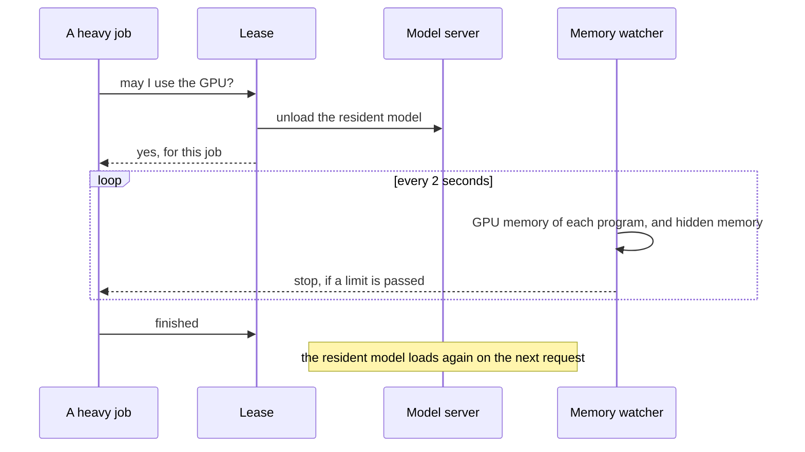

Four things work together: a fixed upper limit for the hidden memory, a kernel control group that protects the
GPU memory of each workload, the rule that every heavy job asks first, and the watcher.

One more rule, learned later: a guard must know who is using the model before it unloads it. One of my guards
unloaded a large model once a minute in the middle of agent tasks, because the model alone was over the guard's
limit. See lesson 5.

## 8. How the system was built

An AI coding agent did much of the building, on the computer itself.

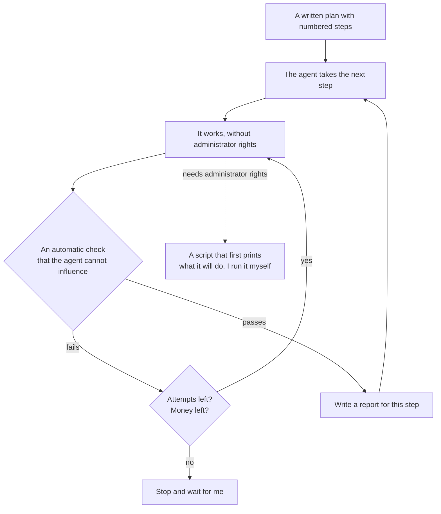

There is a spending limit for each attempt and for the whole plan. Every step leaves a report. One of the steps
was the speed test in the README: I started it, and then I switched off my laptop.

## 9. When the computer stops

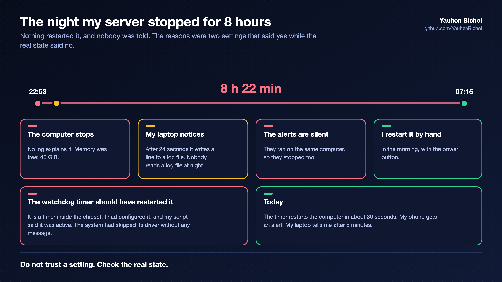

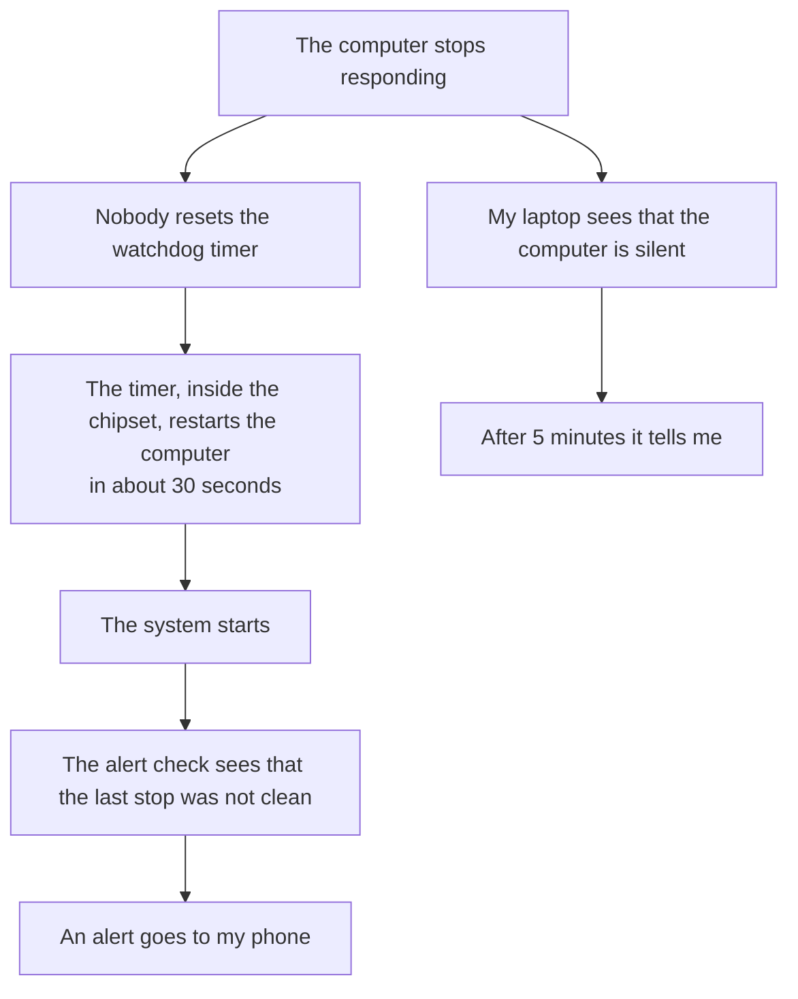

A watchdog is a timer inside the computer's chipset. The system must reset it every few seconds. A program
cannot do this job, because a program stops together with the computer.

The alerts run on the computer that they watch, so a watcher outside it is needed. Today that is my laptop. A
heartbeat to an outside service, which reports when the heartbeat stops, is built and not connected yet.

## 10. Backups

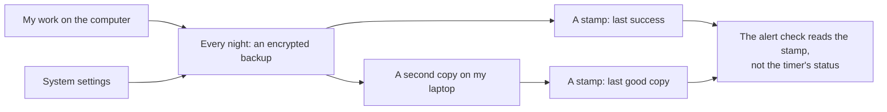

The backup had failed every night for three days before I noticed. The timer was "active" the whole time. Now
the alert reads when the last backup really succeeded.
