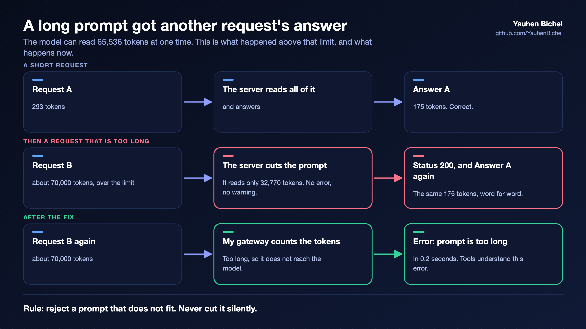

# What I learned

Seven lessons from the first weeks. Most of them are not about models.

## 1. One part models, nine parts operations

Choosing and loading a model took hours. Making the computer safe to leave alone took days: memory limits, a
watchdog timer, alerts, backups, and checks that tell the truth. If you plan such a system, plan your time in
this ratio.

## 2. Reject a prompt that is too long. Never cut it silently

I sent a prompt that was longer than the model's limit. The server cut the prompt to half of the limit. It
returned status 200, which means success. But the answer was the answer to the **previous** request, word for
word. On a shared server, one user could see another user's answer.

I reproduced the error without my gateway, and reported it to the project with exact steps. I now run a fixed
build ([the change](https://github.com/ollama/ollama/pull/18399)). My gateway also counts tokens and rejects a
prompt that is too long, with the normal API error.

My first version of this check had its own error. It counted an image as text, and the vision and OCR models
failed for one day. I found it with a simple daily test that sends a real request to every model. 340 unit
tests had passed the whole time.

**Rules:** reject, do not cut. Test both sides of every limit, with every kind of input. Send real requests to
every model, every day.

## 3. Shared memory hides GPU memory

On this computer the CPU and the GPU share one memory. When the GPU part is full, the AMD driver moves data into
normal system memory. This movement ignores the configured limit. The memory is not assigned to any program, and
it does not appear in the normal memory statistics. On one bad day, 35 to 42 GiB was missing from every report,
and the system stopped other programs again and again to free memory.

One setting did not solve this. I needed four things together:

- a fixed upper limit for this kind of memory;
- the Linux `dmem` control group, which protects the GPU memory of each workload;
- a rule: every heavy job asks for permission before it uses the GPU;
- a small monitor that checks the GPU memory of each program every two seconds.

If you run language models and image generation on one such computer, check this early.

## 4. Make every check read the real state, not the configuration

The computer stopped for 8 hours and 22 minutes, and nobody was informed. No log explains why it stopped. But
I know exactly why it took 8 hours.

A hardware watchdog should have restarted the computer. A watchdog is a timer inside the computer's chipset.
The system must reset this timer every few seconds. If the system stops responding, nobody resets the timer, and
the timer restarts the computer. A program cannot do this job, because a program stops together with the
computer.

I had configured it, and my script reported that it was active. After the next restart it was not active any
more. The Linux distribution blocks this driver by default, and the system skips a blocked driver without any
message. Also, my alerts ran on the same computer, so they stopped too.

During the investigation I found more problems that nobody had noticed. The system backup had failed every
night for three days. The second copy of the backups was four days old. My GPU memory log had recorded the
value 0.0 for four days, because it read the wrong device.

In every case a setting said "yes" while the real state said "no". The tools from this work are public:
[silent-failures](https://github.com/YauhenBichel/silent-failures).

## 5. Protect the model and its cache from other programs

I studied how large agent systems manage a long context, and I expected to need the same methods. Then I looked
at my own agent's records. The context was never the problem: the largest prompt was 17,600 tokens of 64,000.

The problem was somewhere else. When the model server still has the conversation in its cache, a turn is read
in about 1 second, at any length. When the cache is lost, the same turn takes 12 to 35 seconds. One third of the
turns had lost the cache, and they took **92 % of all prompt-reading time**.

I made three guesses about the cause. Two were wrong, and I could show that they were wrong from the data. The
third was right: a safety guard from another project of mine ran once a minute. It unloaded any model when GPU
memory was over its limit. The large reasoning model alone is over that limit. So the guard unloaded it once a
minute, in the middle of agent tasks, for a week. It was all in the logs. Nobody had counted.

On the same day, my own speed test did the same thing to another program. Two programs used two different
models. Only one model fits, so each request removed the other program's model. Every request then paid 41 to 53
seconds of loading.

What I changed:

- the guard now checks that a model is idle before it unloads it, as its own description always said;
- the gateway's queue prefers the model that is already loaded, for at most two minutes;
- a daily count of model loads, with an alert. Normal is under ten a day. The bad days had 130 to 208;
- the agent runner reports the turns that lost the cache.

**Rule:** on a small machine, the first performance question is not "how do I shrink the prompt?". It is
"who else is using the GPU?".

## 6. Local models cannot review code yet

I connected [serge](https://github.com/huggingface/serge) to my gateway. A code review then ran on my own
computer with my own model, and no code left my house. serge worked correctly on the first attempt. The models
did not.

I ran four reviews of the same change. The first was a short approval. The second was twelve comments, and each
one only said that the code was good. The third did not finish in time. The fourth used the 120B reasoning
model. It reported several errors, such as a missing import. None of them existed.

The coding model never used the tools that let it read files. The reasoning model tried to use tools that did
not exist. I removed the review workflow. A reviewer that only praises looks like a quality check, but it is
not one.

This is also why my agent runner does not use tool calls. The model fills a JSON form with a fixed list of
actions, and the model server enforces the form.

## 7. A finding is an assumption until a test confirms it

I made the same mistake as the models. I reported an error in a change after I had only read the change. Then I
wrote a test for it, and the test showed that the error did not exist. I corrected my report in public.

Later I called a failing CI run "temporary, the machine was busy", because a second run had passed. It was not
temporary. The step times showed the real cause, and they had been there to read the whole time.

**Rules:** write the failing test first. Before you explain a failure, read what the system recorded about it.
And keep a journal with times, including your own mistakes. Mine allowed me to rebuild a fix that I had lost.
