# One small computer, eight models

A talk version of this repository: what running my own LLM system at home taught me, and why most of it was not
about models.

[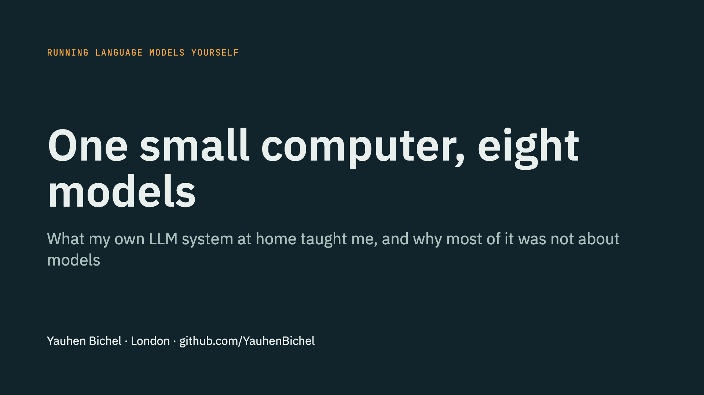](https://cdn.jsdelivr.net/gh/YauhenBichel/yserver-local-llm-system@main/talk/one-small-computer-3-minutes.mp4)

**[Watch the three-minute video](https://cdn.jsdelivr.net/gh/YauhenBichel/yserver-local-llm-system@main/talk/one-small-computer-3-minutes.mp4)** · [the script](NARRATION.md) · download: [with narration](one-small-computer-3-minutes.mp4), [without sound](one-small-computer-3-minutes-silent.mp4)

GitHub does not play a video file that is stored in a repository, so the "watch" link opens the same file
through jsDelivr, a public CDN that serves this repository's files, and your browser plays it.

The video is an overview of the talk, made from the slides. Its narration is a computer voice reading my
script. The demo slide in it shows a real screenshot of [llm-hops](https://github.com/YauhenBichel/llm-hops);
in the talk the demo runs live.

## The talk

One small AMD desktop with 128 GB of shared memory serves open language models to Claude Code, my editor and my
own agents. It answers in 0.64 seconds and writes 50 tokens a second. Getting there took ten days, and nine
tenths of that time went on operations, not models.

The talk is the honest account of that work: a prompt that was cut silently and came back with another
request's answer and status 200, 40 GB of GPU memory that appeared in no report, a night when the machine
stopped for eight hours while every check said it was fine, and a week in which my own safety guard made agents
twenty times slower.

Every number is measured, and each has its method and its limits in [docs/numbers.md](../docs/numbers.md).

**What you take away**

1. How to put one gateway in front of local models: names mapped to roles, a single queue, and a prompt-length
   check that rejects a long prompt instead of cutting it silently.
2. The operations checklist for shared-memory AI machines: GPU memory the normal tools do not show, a hardware
   watchdog that really loads, and alerts that live outside the box.
3. Why a lost prompt cache, not a long context, is what slows local agents, and how to see it with per-hop
   request tracing.

**Length:** 20 minutes plus questions. There is also a five-minute lightning version built on one story, the
prompt that was too long.

## The slides

| | |
|---|---|
|  | 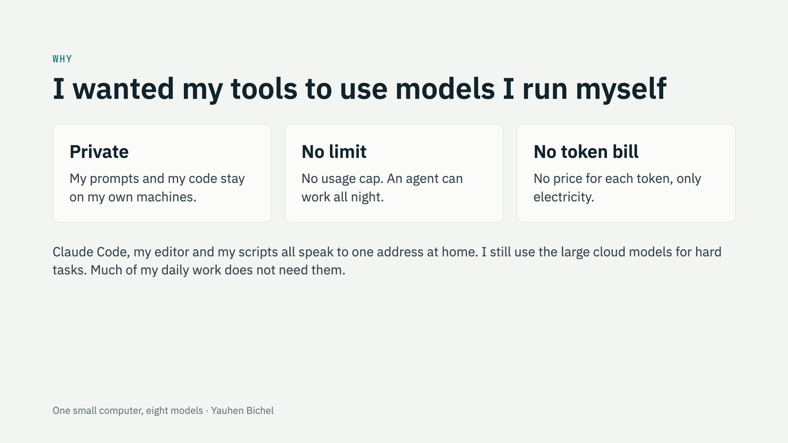 |
|  | 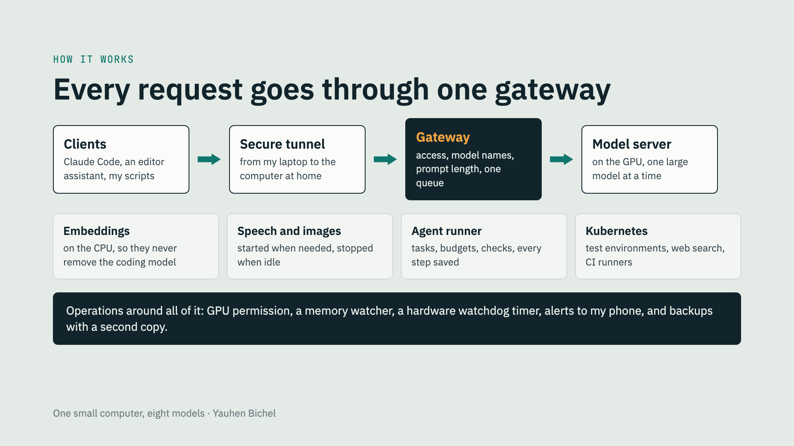 |
| 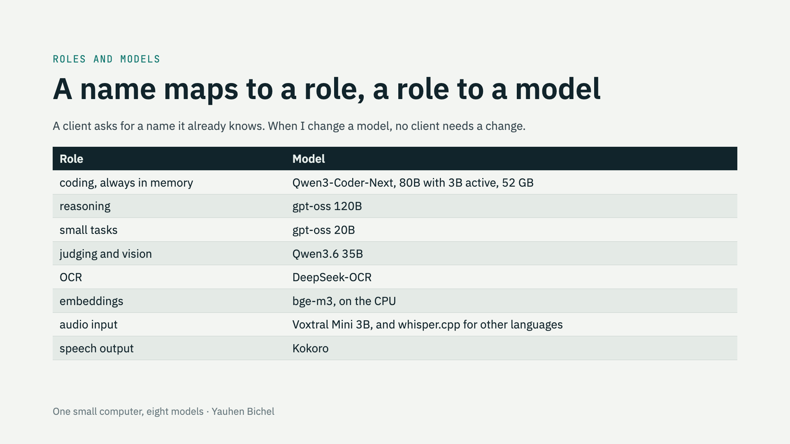 | 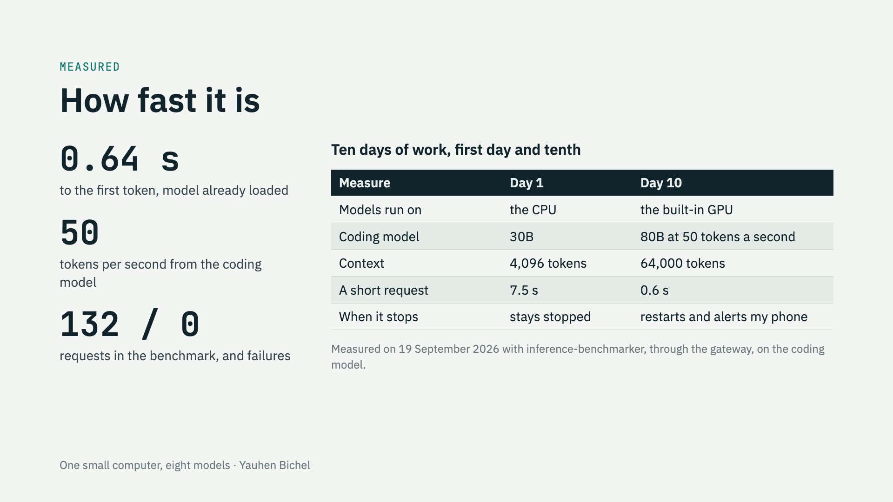 |
| 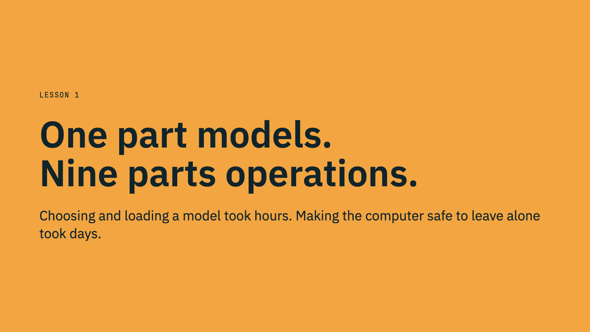 | 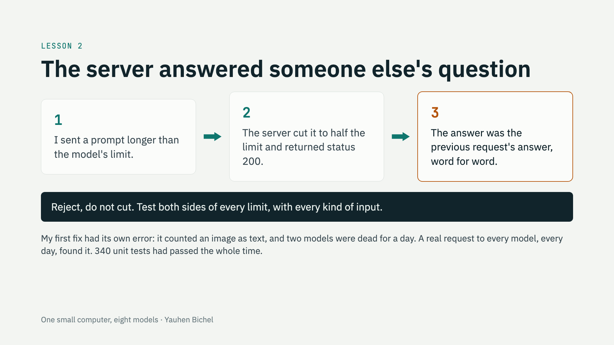 |
| 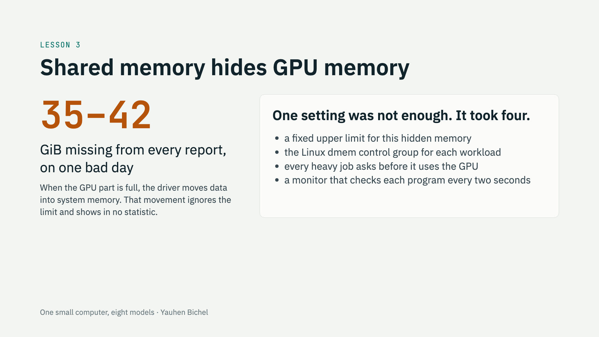 | 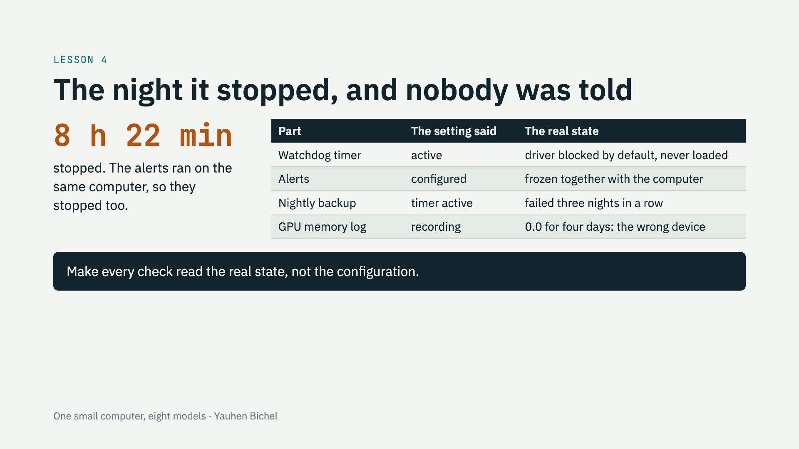 |
| 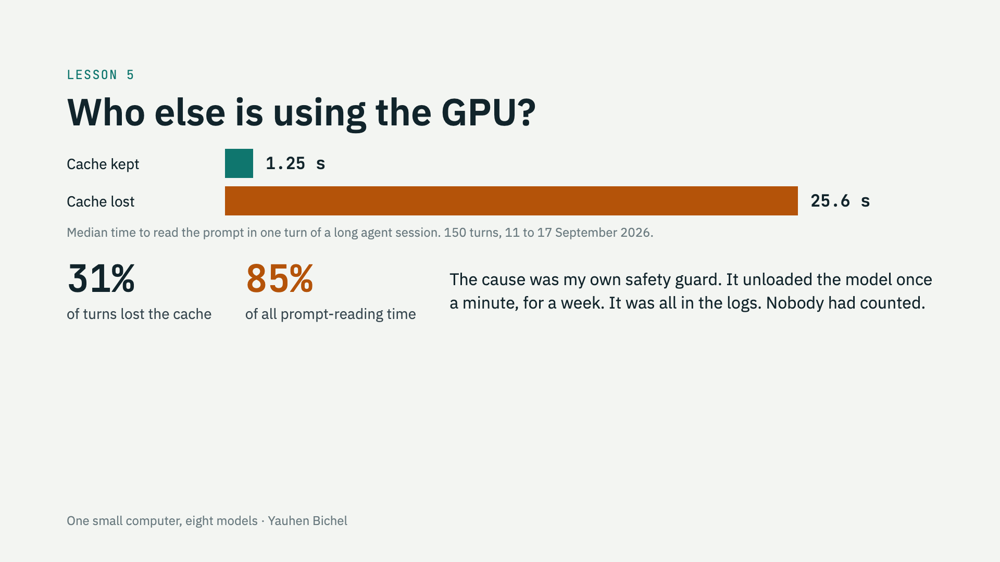 | 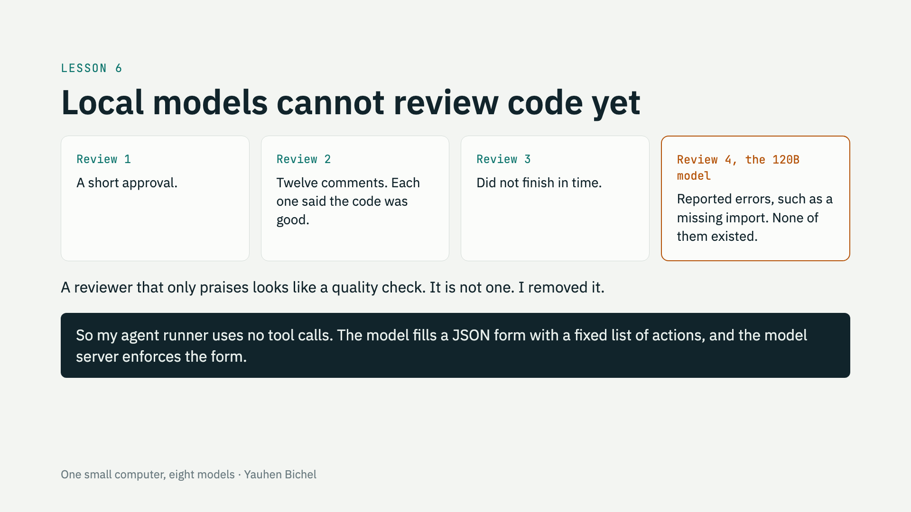 |
| 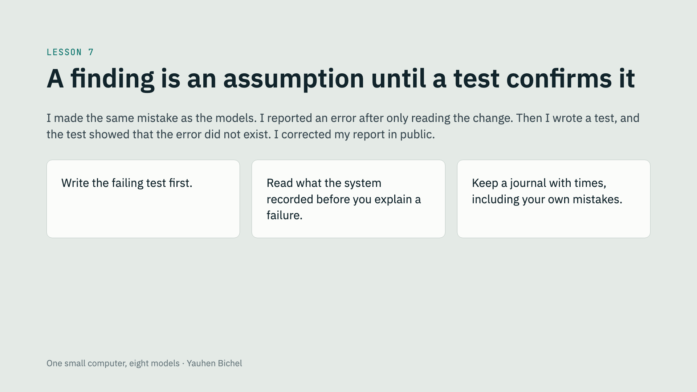 | 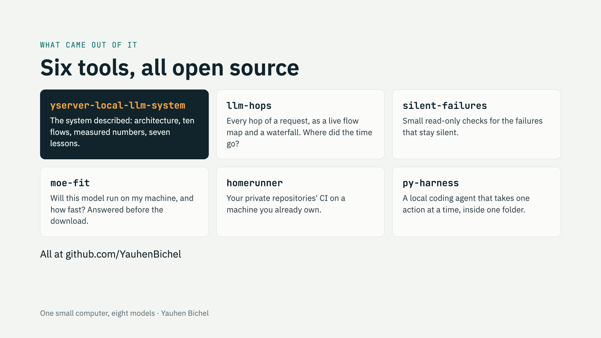 |
| 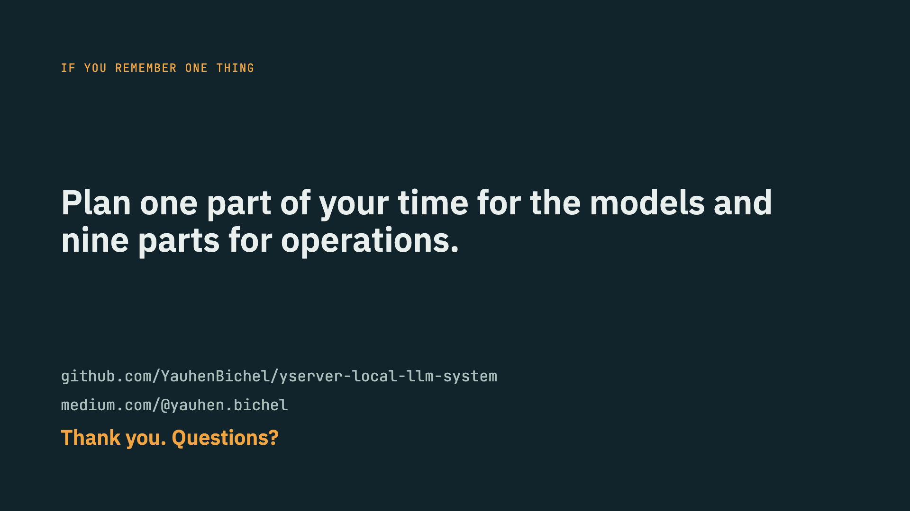 | |

## Where each slide comes from

| Slides | Source in this repository |
|---|---|
| The computer, roles and models | [README](../README.md) |
| Every request goes through one gateway | [docs/architecture.md](../docs/architecture.md), [docs/flows.md](../docs/flows.md) |
| How fast it is, the cache numbers | [docs/numbers.md](../docs/numbers.md) |
| The seven lessons | [docs/lessons.md](../docs/lessons.md) |

## Inviting this talk

I am based in London and glad to give it at a meetup. Write to yauhen.bichel@gmail.com.
